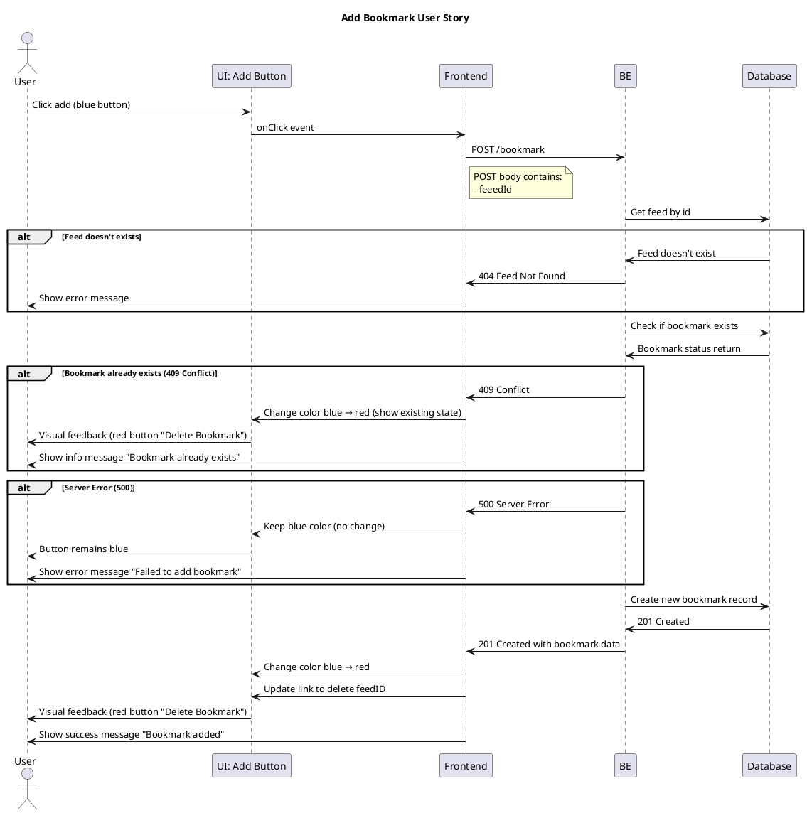

# Add Bookmark User Story

## User Story

**As a user**  
I want to add a bookmark  
**So that** I can save my favorite tracks for quick access later

## Acceptance Criteria

- **Given:** User is viewing content without an existing bookmark
- **When:** User clicks the add bookmark button (blue)
- **Then:** Bookmark is created and saved to their collection
- **And:** Add button changes from blue to red and shows "Delete Bookmark"

## Sequence Diagram



## UI State Flow - Success (201 Created)

1. **Initial State:** Add button is BLUE
2. **User Clicks:** User clicks add button
3. **Feed Validation:** System validates feed exists
4. **Bookmark Check:** System checks if bookmark already exists
5. **Bookmark Creation:** New bookmark record created
6. **Success State:** Add button turns RED and shows "Delete Bookmark"
7. **Link Update:** Button link updated to delete specific feedId
8. **Confirmation:** Success message "Bookmark added" displayed

## UI State Flow - Feed Not Found (404)

1. **Initial State:** Add button is BLUE
2. **User Clicks:** User clicks add button
3. **Feed Validation:** System cannot find the feed
4. **Error State:** Add button REMAINS BLUE (no color change)
5. **Error Message:** "Feed not found" error displayed

## UI State Flow - Bookmark Already Exists (409 Conflict)

1. **Initial State:** Add button is BLUE
2. **User Clicks:** User clicks add button
3. **Feed Validation:** System validates feed exists
4. **Bookmark Check:** System finds existing bookmark
5. **Conflict State:** Add button turns RED and shows "Delete Bookmark" (reveals existing bookmark)
6. **Information:** Info message "Bookmark already exists" displayed

## UI State Flow - Server Error (500)

1. **Initial State:** Add button is BLUE
2. **User Clicks:** User clicks add button
3. **Processing:** System processes bookmark creation
4. **Error State:** Add button REMAINS BLUE (no color change)
5. **Error Message:** "Failed to add bookmark" displayed

## Technical Implementation

### Button States
- **Blue** = Ready to Add Bookmark
- **Red** = Bookmark Exists (Ready to Delete)

### API Endpoint
- **Endpoint:** `POST /api/bookmark`
- **Success Response:** `201 Created` → Button turns red, link updated to delete feedId
- **Feed Not Found:** `404 Not Found` → Button stays blue
- **Conflict Response:** `409 Conflict` → Button turns red (bookmark already exists)
- **Server Error Response:** `500 Server Error` → Button stays blue

### Frontend Flow
1. onClick event triggered
2. Backend API call made with bookmark data
3. Success/Conflict/Error response received
4. Color change or stay same based on response

### Request Payload
```json
{
  "feedId": "string"
}
```
### Repsonse Payload
```json
{
    "bookmarkId": "<<BOOKMARK_ID>>",
    "trackPath": "<<TRACK_PATH>>",
}
```
## Key Features

- **Feed Validation:** System validates feed exists before creating bookmark
- **Success (201):** Color change (blue → red) with delete link update provides immediate visual feedback
- **Feed Not Found (404):** Button stays blue to indicate invalid feed
- **Conflict (409):** Button turns red (reveals existing bookmark state)
- **Server Error (500):** Button stays blue to indicate system failure
- **Red indicates:** Bookmark exists and can be deleted (with specific feedId)
- **Blue indicates:** No bookmark exists, ready to add

## Visual Feedback Summary

| State | HTTP Code | Button Color | Button Text | User Feedback | Additional Action |
|-------|-----------|-------------|-------------|---------------|------------------|
| Initial | - | Blue | "Add Bookmark" | Ready to add | - |
| Success | 201 Created | Red | "Delete Bookmark" | "Bookmark added" message | Link updated to delete feedId |
| Feed Not Found | 404 Not Found | Blue | "Add Bookmark" | "Feed not found" error | - |
| Conflict | 409 Conflict | Red | "Delete Bookmark" | "Bookmark already exists" info | - |
| Server Error | 500 | Blue | "Add Bookmark" | "Failed to add bookmark" error | - |

The two buttons form a toggle system where one state leads to the other, providing seamless bookmark management for users.