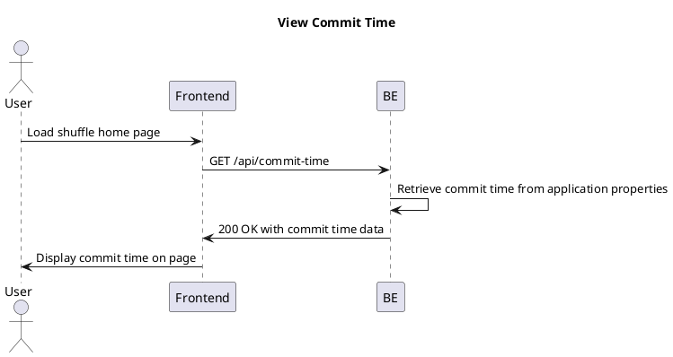
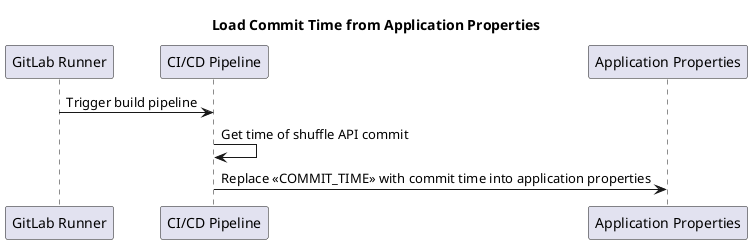

# Add Bookmark User Story

## User Story

**As a user**  
I want to know when the shuffle API was committed
**So that** I can know which vwersion introduced the feature

## Acceptance Criteria

- **Given:** User is viewing content on the shuffle home page
- **When:** The page is loaded
- **Then:** The commit history is displayed showing the shuffle API commit details

## Sequence Diagram



## Insert Diagram


### Request Payload
```json
{
  "feedId": "string"
}
```
### Request Payload
```json
{
    "bookmarkId": "<<BOOKMARK_ID>>",
    "trackPath": "<<TRACK_PATH>>",
}
```
## Key Features

- **Feed Validation:** System validates feed exists before creating bookmark
- **Success (201):** Color change (blue → red) with delete link update provides immediate visual feedback
- **Feed Not Found (404):** Button stays blue to indicate invalid feed
- **Conflict (409):** Button turns red (reveals existing bookmark state)
- **Server Error (500):** Button stays blue to indicate system failure
- **Red indicates:** Bookmark exists and can be deleted (with specific feedId)
- **Blue indicates:** No bookmark exists, ready to add

## Visual Feedback Summary

| State | HTTP Code | Button Color | Button Text | User Feedback | Additional Action |
|-------|-----------|-------------|-------------|---------------|------------------|
| Initial | - | Blue | "Add Bookmark" | Ready to add | - |
| Success | 201 Created | Red | "Delete Bookmark" | "Bookmark added" message | Link updated to delete feedId |
| Feed Not Found | 404 Not Found | Blue | "Add Bookmark" | "Feed not found" error | - |
| Conflict | 409 Conflict | Red | "Delete Bookmark" | "Bookmark already exists" info | - |
| Server Error | 500 | Blue | "Add Bookmark" | "Failed to add bookmark" error | - |

The two buttons form a toggle system where one state leads to the other, providing seamless bookmark management for users.