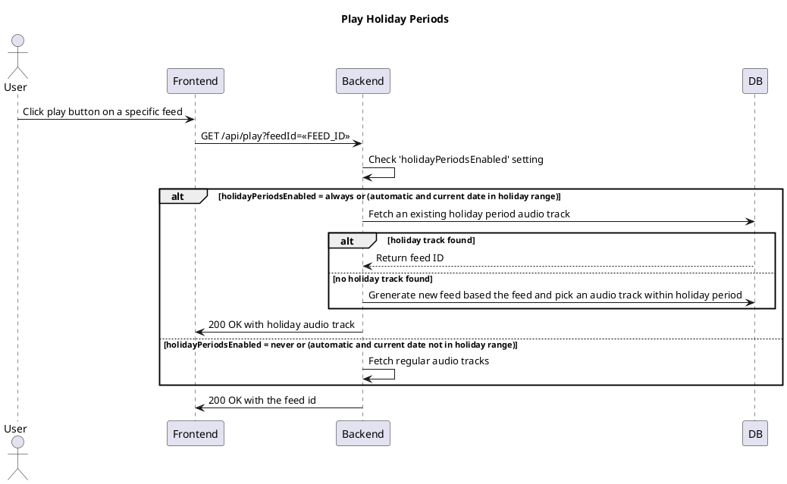

# Play Hoiliday Periods

## User Story
**As a listener**
I want to play holiday periods in my sequence track player
**So that** I listen to holiday-themed audio during specific times of the year

## Acceptance Criteria
- **Given:** A user that has clicked play

## Setting

The setting 'holidayPeriodsEnabled' can be toggled to:
- <b>ALWAYS</b>: Holiday periods are always played regardless of the date
- <b>NEVER</b>: Holiday periods are never played
- <b>AUTOMATIC</b>: Holiday periods are played only during specific holiday dates (e.g., December 20 - December 31 for Christmas/New Year)

## Sequence Diagram

